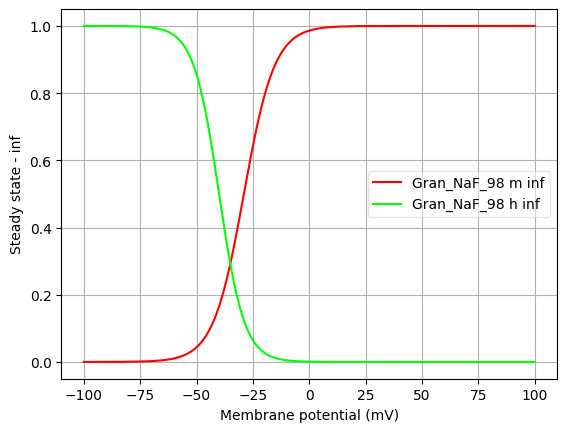
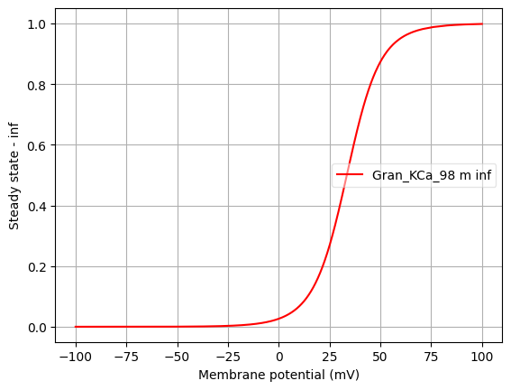
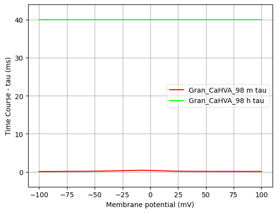

Channel information
===================

Channel information at: T = 32.0 degC, E_rev = 0 mV, [Ca2+] = 5e-05 mM

<h2>Gran_NaF_98</h2>

Ion: <b>na</b> |
Conductance expression: <b>g = gmax * m3 * h </b> |
NeuroML2 file: <a href="../Gran_NaF_98.channel.nml">Gran_NaF_98.channel.nml</a>

Notes
Fast inactivating Na+ channel

<h2>Gran_KA_98</h2>

Ion: <b>k</b> |
Conductance expression: <b>g = gmax * m3 * h </b> |
NeuroML2 file: <a href="../Gran_KA_98.channel.nml">Gran_KA_98.channel.nml</a>

Notes
A-type K channel, with rate equations expressed in tau and inf form

<h2>Gran_KCa_98</h2>

Ion: <b>k</b> |
Conductance expression: <b>g = gmax * m </b> |
NeuroML2 file: <a href="../Gran_KCa_98.channel.nml">Gran_KCa_98.channel.nml</a>

Notes
Calcium dependent K+ channel

<h2>Gran_CaHVA_98</h2>

Ion: <b>ca</b> |
Conductance expression: <b>g = gmax * m2 * h </b> |
NeuroML2 file: <a href="../Gran_CaHVA_98.channel.nml">Gran_CaHVA_98.channel.nml</a>

Notes
A High Voltage Activated Ca2+ channel

