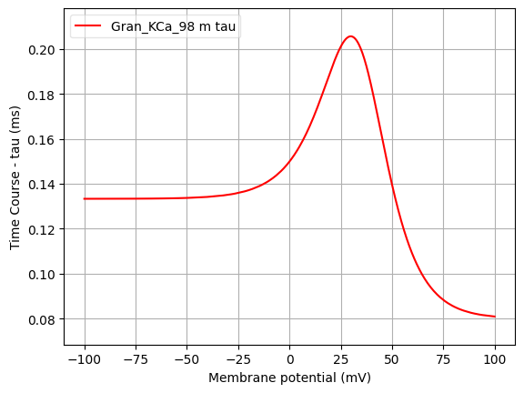

Channel information
===================
    

Channel information at: T = 32.0 degC, E_rev = 0 mV, [Ca2+] = 5e-05 mM

<table>
    <tr>
<td width="120px">
            
<b>Gran_NaF_98</b> 
            <a href="../Gran_NaF_98.channel.nml">Gran_NaF_98.channel.nml</a>  
            
<b>Ion: na</b>
  
            g = gmax * m3 * h   
            Fast inactivating Na+ channel 

</td>
<td>

</td>
<td>

</td>
</tr>
    <tr>
<td width="120px">
            
<b>Gran_KA_98</b> 
            <a href="../Gran_KA_98.channel.nml">Gran_KA_98.channel.nml</a>  
            
<b>Ion: k</b>
  
            g = gmax * m3 * h   
            A-type K channel, with rate equations expressed in tau and inf form 

</td>
<td>

</td>
<td>

</td>
</tr>
    <tr>
<td width="120px">
            
<b>Gran_KCa_98</b> 
            <a href="../Gran_KCa_98.channel.nml">Gran_KCa_98.channel.nml</a>  
            
<b>Ion: k</b>
  
            g = gmax * m   
            Calcium dependent K+ channel 

</td>
<td>

</td>
<td>

</td>
</tr>
    <tr>
<td width="120px">
            
<b>Gran_CaHVA_98</b> 
            <a href="../Gran_CaHVA_98.channel.nml">Gran_CaHVA_98.channel.nml</a>  
            
<b>Ion: ca</b>
  
            g = gmax * m2 * h   
            A High Voltage Activated Ca2+ channel 

</td>
<td>

</td>
<td>

</td>
</tr>
</table>

